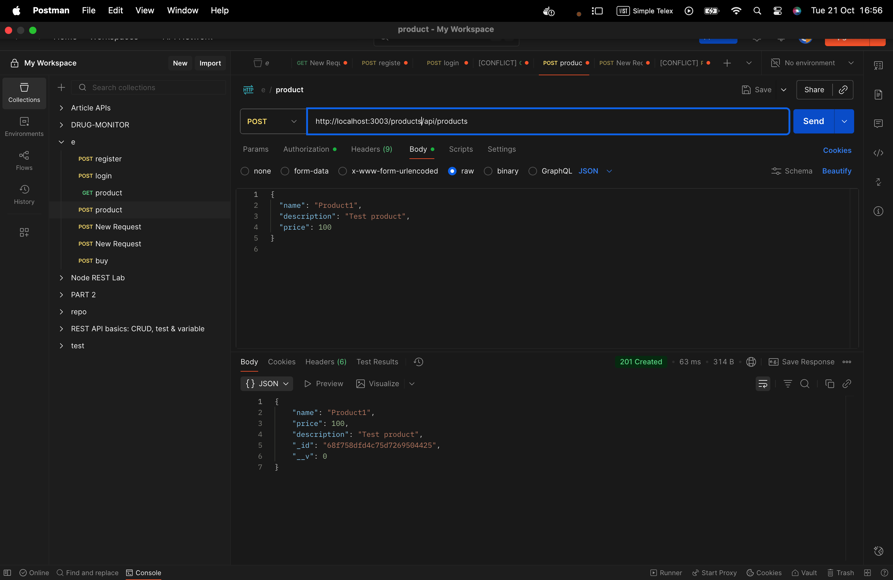

# EProject (Microservices)

Ngắn gọn: EProject là một hệ thống microservices gồm 4 thành phần chính: auth, product, order và api-gateway. Dữ liệu lưu trên MongoDB; RabbitMQ dùng làm message broker. Project dùng Docker / docker-compose để khởi chạy toàn bộ hệ thống.

## Kiến trúc & Thành phần
- auth: dịch vụ xác thực (đăng ký, đăng nhập, trả JWT). Port mặc định: 3000  
- product: quản lý sản phẩm (CRUD). Port mặc định: 3001  
- order: quản lý đơn hàng, xuất sự kiện tới RabbitMQ. Port mặc định: 3002  
- api-gateway: gateway tổng hợp, chuyển tiếp request tới các service nội bộ, thực hiện xác thực JWT. Port mặc định: 3003  
- MongoDB: 27017  
- RabbitMQ: 5672 (AMQP), 15672 (management UI)

## Yêu cầu
- Docker & Docker Compose (v2+)  
- (Tùy chọn) Node.js & npm nếu muốn chạy service cục bộ

## Chạy nhanh bằng Docker Compose (Mac)
1. Mở terminal tại thư mục project:
   cd /Users/letranhoailoc/Downloads/EProject-Phase-1
2. Build image (chỉ api-gateway hoặc toàn bộ):
   docker compose build api-gateway
   hoặc
   docker compose build
3. Khởi động service:
   docker compose up -d
4. Kiểm tra:
   docker compose ps
   docker logs -f api_gateway

## Nếu muốn build image thủ công
- Từ thư mục project:
  docker build -t myorg/api-gateway:latest ./api-gateway
- Sau đó chỉnh docker-compose (thay `build:` bằng `image:`) hoặc chạy:
  docker compose up -d

## Test API (Postman / Newman)
- Gateway entrypoint: http://localhost:3003
- Gợi ý endpoint:
  - POST /auth/register
  - POST /auth/login
  - GET /products
  - POST /orders (Authorization: Bearer <token>)
- Tạo collection Postman, hoặc dùng newman:
  1. Lưu collection.json và environment.json vào project
  2. Cài newman: npm install -g newman
  3. Chạy: newman run collection.json -e environment.json --reporters cli,json --reporter-json-export report.json
- Lưu file `report.json` hoặc xuất HTML làm minh chứng.

## Cấu trúc thư mục chính
- api-gateway/  
- auth/  
- product/  
- order/  
- public/  ← đặt ảnh minh họa ở đây  
- docker-compose.yml

## Ghi chú triển khai & debug
- Kiểm tra biến môi trường trong từng `./<service>/.env`  
- Nếu một service cần thời gian để khởi động (DB, RabbitMQ), dùng `docker compose logs -f <service>` để debug.  
- Sử dụng `docker compose down --volumes` để dọn volumes khi cần reset DB.
## Test với postman
register

login

danh sách sản phẩm

thêm sản phẩm

mua

docker 

docker hub

ci/cd
