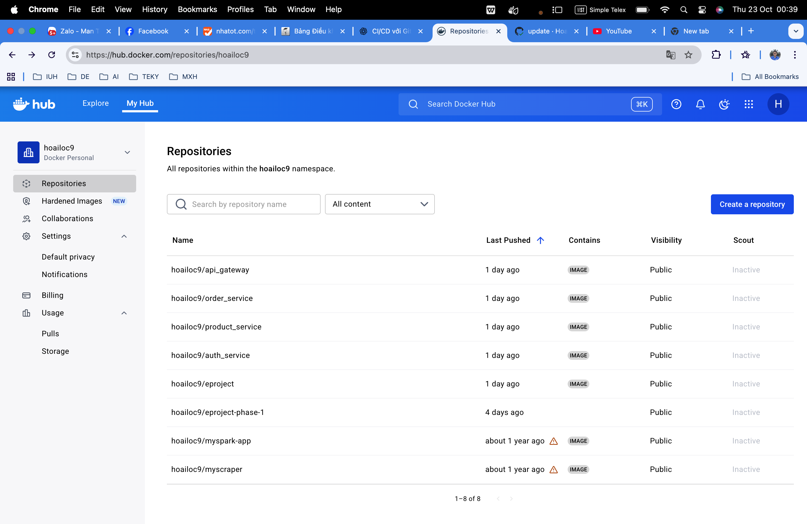
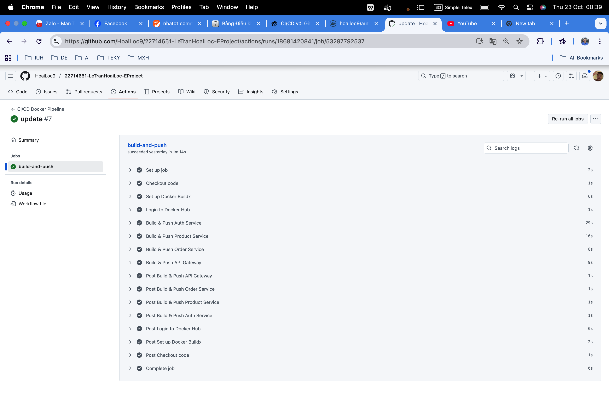

# EProject (Microservices)

Ngắn gọn: EProject là một hệ thống microservices gồm 4 thành phần chính: auth, product, order và api-gateway. Dữ liệu lưu trên MongoDB; RabbitMQ dùng làm message broker. Project dùng Docker / docker-compose để khởi chạy toàn bộ hệ thống.

## Kiến trúc & Thành phần
- auth: dịch vụ xác thực (đăng ký, đăng nhập, trả JWT). Port mặc định: 3000  
- product: quản lý sản phẩm (CRUD). Port mặc định: 3001  
- order: quản lý đơn hàng, xuất sự kiện tới RabbitMQ. Port mặc định: 3002  
- api-gateway: gateway tổng hợp, chuyển tiếp request tới các service nội bộ, thực hiện xác thực JWT. Port mặc định: 3003  
- MongoDB: 27017  
- RabbitMQ: 5672 (AMQP), 15672 (management UI)

## Yêu cầu
- Docker & Docker Compose (v2+)  
- (Tùy chọn) Node.js & npm nếu muốn chạy service cục bộ

## Chạy nhanh bằng Docker Compose (Mac)
1. Mở terminal tại thư mục project:
   cd /Users/letranhoailoc/Downloads/EProject-Phase-1
2. Build image (chỉ api-gateway hoặc toàn bộ):
   docker compose build api-gateway
   hoặc
   docker compose build
3. Khởi động service:
   docker compose up -d
4. Kiểm tra:
   docker compose ps
   docker logs -f api_gateway

## Nếu muốn build image thủ công
- Từ thư mục project:
  docker build -t myorg/api-gateway:latest ./api-gateway
- Sau đó chỉnh docker-compose (thay `build:` bằng `image:`) hoặc chạy:
  docker compose up -d

## Test API (Postman / Newman)
- Gateway entrypoint: http://localhost:3003
- Gợi ý endpoint:
  - POST /auth/register
  - POST /auth/login
  - GET /products
  - POST /orders (Authorization: Bearer <token>)
- Tạo collection Postman, hoặc dùng newman:
  1. Lưu collection.json và environment.json vào project
  2. Cài newman: npm install -g newman
  3. Chạy: newman run collection.json -e environment.json --reporters cli,json --reporter-json-export report.json
- Lưu file `report.json` hoặc xuất HTML làm minh chứng.

## Cấu trúc thư mục chính
- api-gateway/  
- auth/  
- product/  
- order/  
- public/  ← đặt ảnh minh họa ở đây  
- docker-compose.yml

## Ghi chú triển khai & debug
- Kiểm tra biến môi trường trong từng `./<service>/.env`  
- Nếu một service cần thời gian để khởi động (DB, RabbitMQ), dùng `docker compose logs -f <service>` để debug.  
- Sử dụng `docker compose down --volumes` để dọn volumes khi cần reset DB.
## Test với postman
register

login

danh sách sản phẩm

thêm sản phẩm

mua

docker 

docker hub

ci/cd

### Hệ thống giải quyết vấn đề gì
Xây dựng một hệ thống thương mại/đặt hàng theo kiến trúc microservices: xác thực người dùng, quản lý sản phẩm, tạo/ghi nhận đơn hàng và một API Gateway để tổng hợp/điều phối request.
==> Mục tiêu: tách trách nhiệm, dễ mở rộng, xử lý event (ví dụ thông báo/đồng bộ) qua message broker và lưu trữ trên MongoDB.
### Hệ thống có bao nhiêu dịch vụ
4 dịch vụ ứng dụng chính:
+ auth
+ product
+ order
+ api-gateway
Ngoài ra hai thành phần hạ tầng chạy với Docker Compose: mongodb và rabbitmq.
### Ý nghĩa từng dịch vụ (tóm tắt)
+ auth: xử lý đăng ký/đăng nhập, phát JWT và xác thực; (tham khảo: auth/src/controllers/authController.js, auth/src/services/authService.js).
+ product: CRUD sản phẩm, trả dữ liệu sản phẩm qua API; (product/src/controllers/productController.js, productsService, productsRepository).
+ order: tạo và lưu đơn hàng, phát sự kiện tới RabbitMQ để các hệ thống khác (hoặc xử lý async) tiêu thụ; (order/src/models/order.js, order/src/utils/messageBroker.js).
+ api-gateway: điểm tiếp nhận cho client, định tuyến request tới service phù hợp và thực hiện xác thực JWT trước khi chuyển tiếp; (api-gateway/index.js, api-gateway/.env).
### Các mẫu thiết kế được sử dụng
+ Microservices architecture — tách dịch vụ theo miền chức năng.
+ API Gateway pattern — một entrypoint duy nhất cho client.
+ Layered/MVC-like pattern: Controller → Service → Repository (tách logic xử lý và truy xuất dữ liệu). Ví dụ: controllers, services, repositories thư mục hiện diện trong nhiều service.
+ Repository pattern — encapsulate truy vấn DB (ví dụ userRepository, productsRepository).
+ Middleware pattern — middleware xác thực JWT (ví dụ authMiddleware.js, isAuthenticated.js).
+ Event-driven / Pub‑Sub qua Message Broker (RabbitMQ) để phát/tiêu thụ sự kiện giữa services.
+ Containerization / CI-CD: Dockerfile cho mỗi service, docker-compose, và workflow CI trong .github/workflows/docker-ci-cd.yml.
### Các dịch vụ giao tiếp như thế nào
+ HTTP/REST: client → api-gateway → nội bộ các service (mỗi service lắng nghe cổng riêng: auth:3000, product:3001, order:3002, gateway:3003). (xem docker-compose.yml và các index.js).
+ JWT: auth cấp token; api-gateway và middleware kiểm tra Authorization header Bearer <token> để xác thực. (authMiddleware / isAuthenticated).
+ Message broker (RabbitMQ): order (và có util messageBroker trong product/order) publish/subscribe sự kiện bất đồng bộ giữa services.
+ MongoDB: các service lưu/đọc dữ liệu (user, product, order) trực tiếp từ MongoDB.
Docker network: các container kết nối trên mạng bridge (eproject-network) do docker-compose cấu hình.